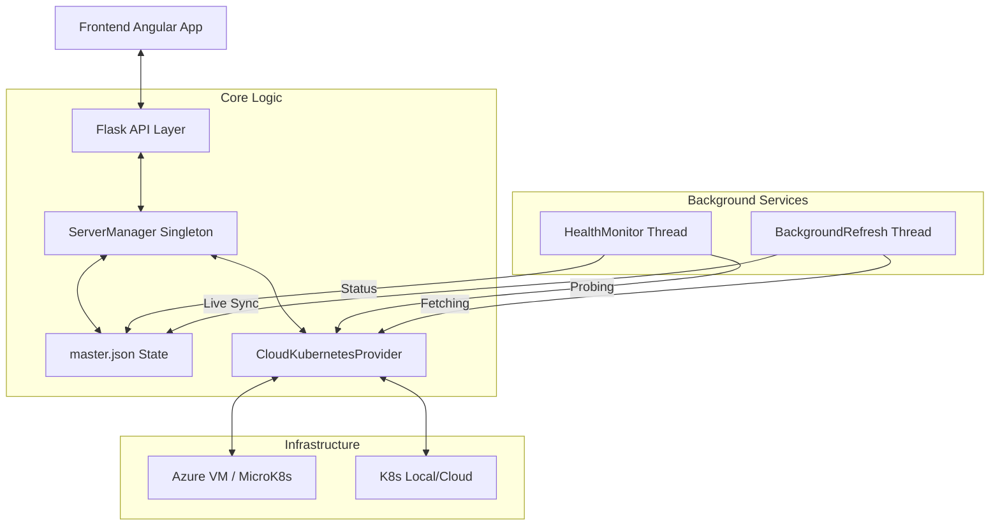

# Backend Architecture Overview

## 1. High-Level Diagram

## 2. Design Principles

### 2.1 State-First Approach
The UI interacts primarily with a local snapshot (`master.json`). This ensures the dashboard remains responsive even if communication with a remote Azure VM is high-latency. Synchronicity is maintained via background pulling rather than blocking API calls.

### 2.2 Provider Abstraction
All provider-specific logic (K8s API calls, unit parsing) is encapsulated in the `providers/` directory. The `ServerManager` only deals with standardized `PodInfo` and `ServerResources` objects.

### 2.3 Atomic Resource Reservations
To prevent race conditions where two users attempt to take the last 2GB of RAM on a server, the `ServerManager` uses atomic updates to `master.json`. It marks resources as "Allocated" the moment a request is validated, before the K8s operation even begins.

---

## 3. Data Flow

1. **Southbound**: `ServerManager` -> `CloudKubernetesProvider` -> `Kubernetes API`.
2. **Northbound**: `Kubernetes API` -> `BackgroundRefreshService` -> `master.json` -> `Frontend`.
3. **Internal**: `HealthMonitor` probes the link status and updates `server.status` in the background.

## 4. Security & Connectivity
- **Credentials**: Stored in `master.json` (host, username, password).
- **Kubeconfig**: Generated on-the-fly and stored in memory or temporary files.
- **CORS**: Configured in `config/config.py` to allow specific frontend origins.
