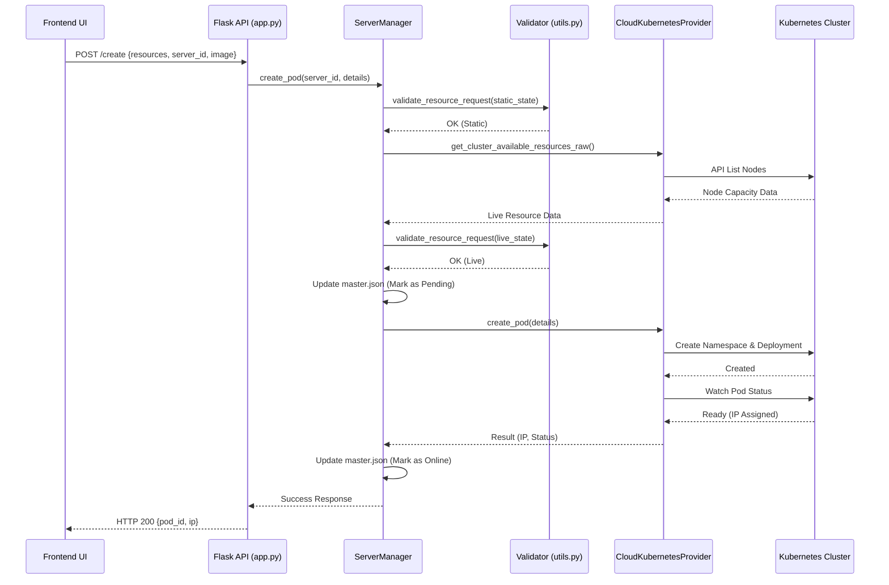

# Resource Manager Backend Manual

This document provides a comprehensive guide to the Resource Manager Backend, detailing its codes, functionalities, and control flows.

## 1. System Overview

The Resource Manager Backend is a Python-based Flask application that serves as a central hub for managing Kubernetes clusters and Azure-hosted MicroK8s instances. It provides a RESTful API for the frontend UI to interact with multiple clusters in a unified way.

---

## 2. Core Functionalities

The backend implements four major pillars of functionality:

### 2.1 Server & Cluster Management
- **Registration**: Allows adding new clusters by providing IP, SSH/API credentials.
- **Kubeconfig Automation**: Automatically generates and configures `kubeconfig` files from raw credentials for seamless K8s communication.
- **Multi-Server Support**: Manages a list of servers stored in `data/master.json`.

### 2.2 Pod Lifecycle Management
- **Provisioning**: Creates Kubernetes Deployments based on resource requests (CPU, RAM, Storage).
- **Isolation**: Implements a "one-namespace-per-pod" (or per deployment) strategy to ensure resource isolation and clean deletions.
- **Scaling**: Support for replica sets within deployments.
- **Destruction**: Robustly deletes namespaces, cleaning up all sub-resources (Pods, Services, Deployments, Ingresses).

### 2.3 Resource Tracking & Validation
- **Two-Tier Validation**:
    1. **Static Check**: Checks against the `master.json` allocated resources to prevent logic-level oversubscription.
    2. **Live Check**: Queries the actual K8s nodes to verify real-time capacity before deployment.
- **Utilization Modeling**: Tracks Total, Allocated, and Available resources per server.

### 2.4 Monitoring & Synchronization
- **Health Monitoring**: Continuous background thread checking cluster connectivity, node status, and pod health.
- **Live Sync**: A background refresh service that periodically polls K8s API to ensure the local state (`master.json`) matches the real world.

---

## 3. Control Flow Analysis

### 3.1 Request Execution Path (e.g., Creating a Pod)

### 3.2 Background Maintenance Flows

#### Health Monitor Flow
- **Trigger**: Starts on application launch (`main.py`).
- **Logic**: Every 30 seconds, `HealthMonitor` loops through configured servers.
- **Checks**: Connectivity -> API Resp -> Node Status -> Pod Failures.
- **Action**: Updates the `status` field in the global state.

#### Background Refresh Flow
- **Trigger**: Configurable interval (Default 60s).
- **Logic**: `BackgroundRefreshService` pulls full node/pod lists from every server.
- **Action**: Overwrites `master.json` with ground-truth data from the clusters.

---

## 4. Key Code Modules

| Module | File | Responsibility |
| :--- | :--- | :--- |
| **App Entry** | `main.py` | Starts the Flask server and initializes background threads. |
| **API Endpoints** | `core/app.py` | Defines REST routes and transforms requests for the `ServerManager`. |
| **Core Logic** | `core/server_manager.py` | State machine for pods and servers. Singleton pattern. |
| **K8s Wrapper** | `providers/cloud_kubernetes_provider.py` | Low-level logic using `kubernetes-python-client`. |
| **Config API** | `core/server_configuration_api.py` | Handles cluster registration and credential generation. |
| **Shared Helpers** | `config/utils.py` | Resource calculation, SSH logic, and UI status mapping. |

---

## 5. Persistence Mode

The system uses **`data/master.json`** as its primary persistent store. 
- **Why?** It allows for lightning-fast UI responses (no waiting for K8s API on every page load).
- **Integrity**: Background services ensure this file never drifts significantly from the actual cluster state.
